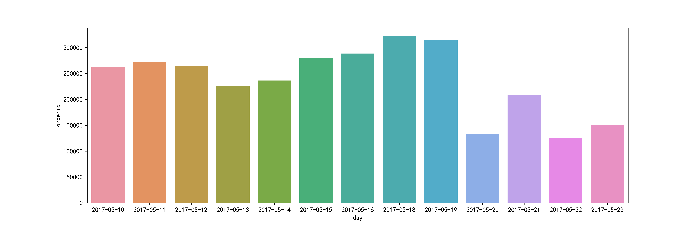
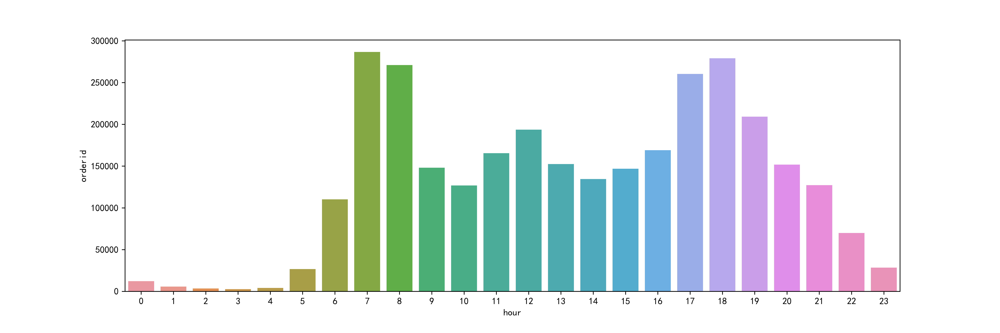
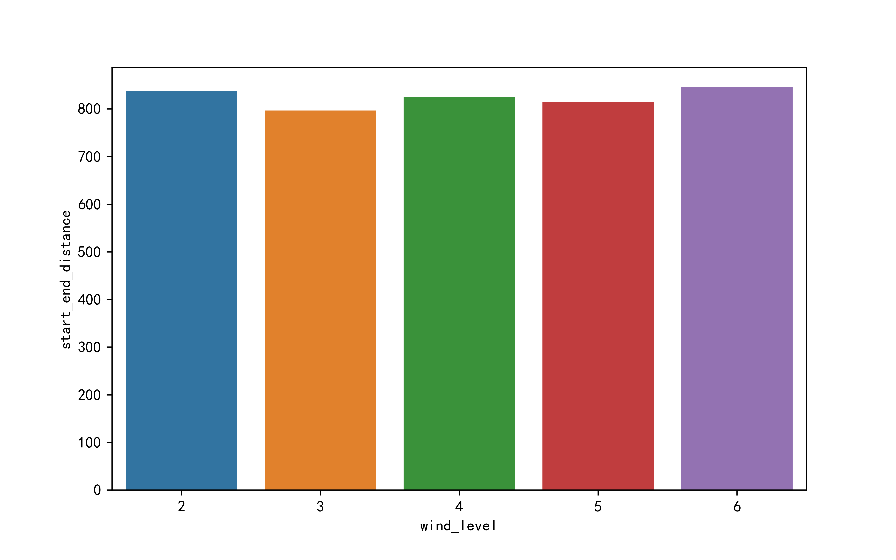
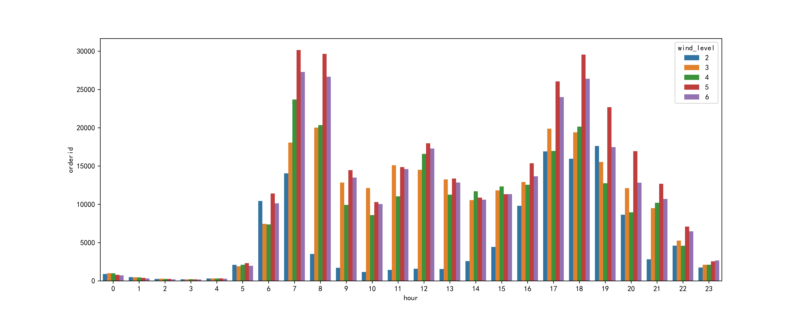
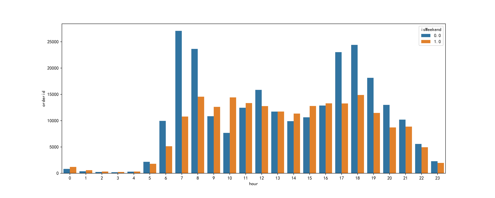
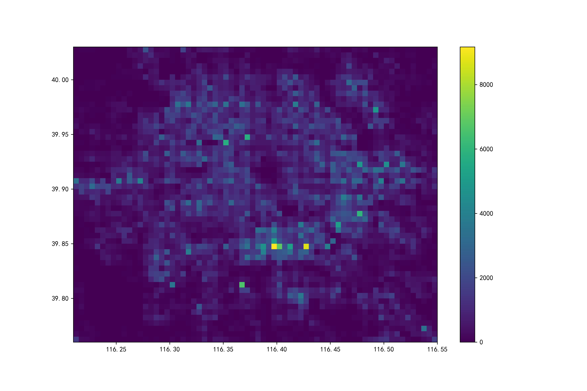

# Bicycle Sharing Data Analysis
This project analyzes the encoded customer data from Mobike and Didi. The raw csv file in the `raw_data` folder are too large to be uploaded (>80MB).

### **Results Overview**

- Daily order histogram:

  
- Hourly order histogram:

    
- Effect of wind on distance:

      
- Wind levels effect:

        
- Effect of workday or not:
        

- End location 2D-histplot:

### **Note**
The 2D histplots of each journey location frequencies are plotted using professional graphical visualization tool called **folium**. Check the `output` folder to see the html heatmap in details.
