# Dry Beans' Classification
This machine learning project resolves a multiclass classification problem of soy bean's classification.  
Highest score of report and presentation received from the whole class.  

#### Result Overview
- Dry beans' dataset:

  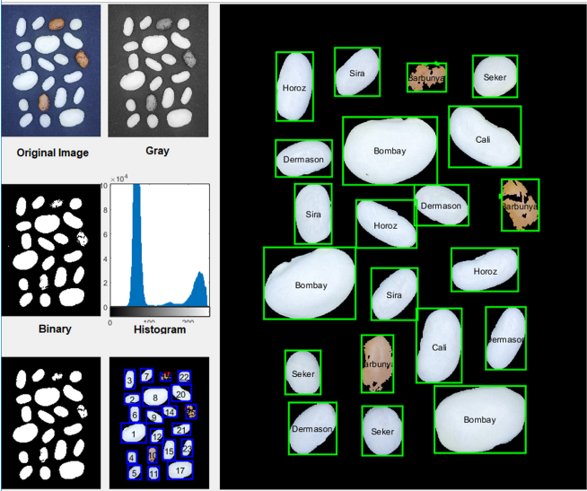

- Features Pairplot:

  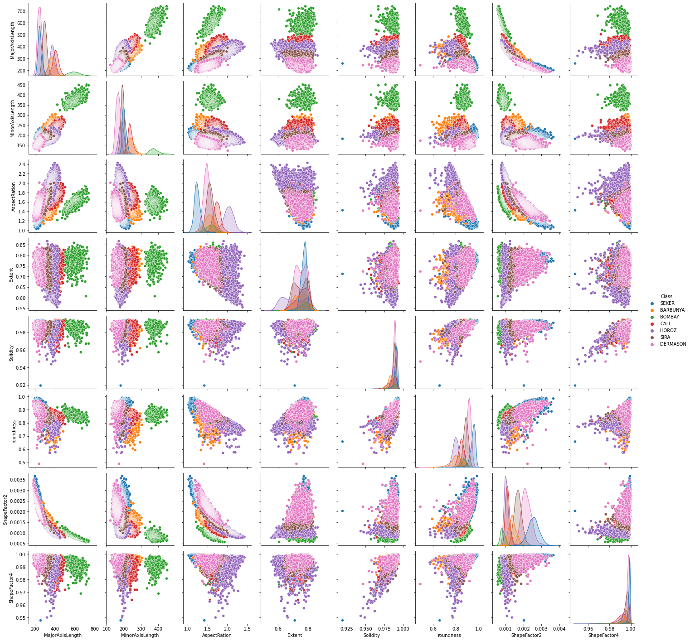

- Correlation matrix before feature selection:

  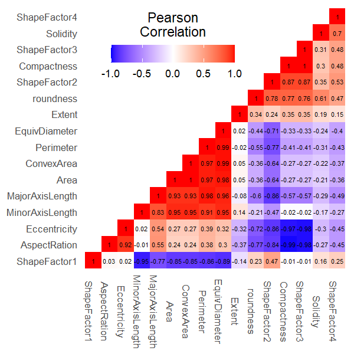

- Correlation matrix after feature selection:

  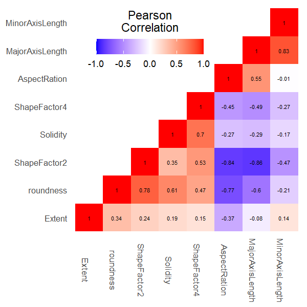

- Boosting:

  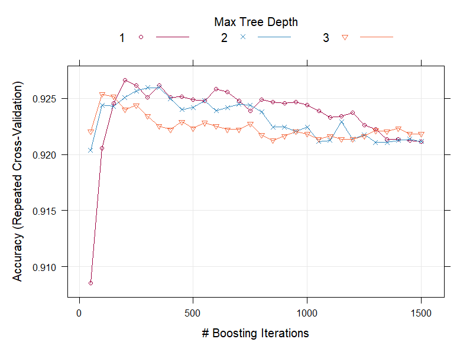
  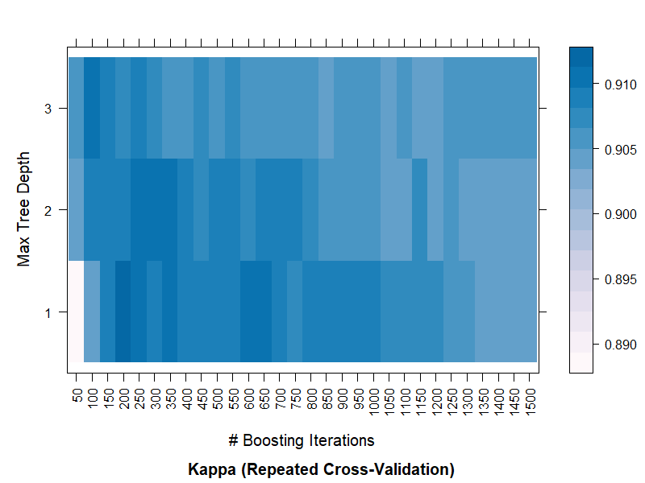

- Important features by random forest:

  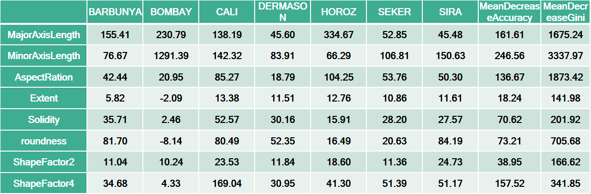
  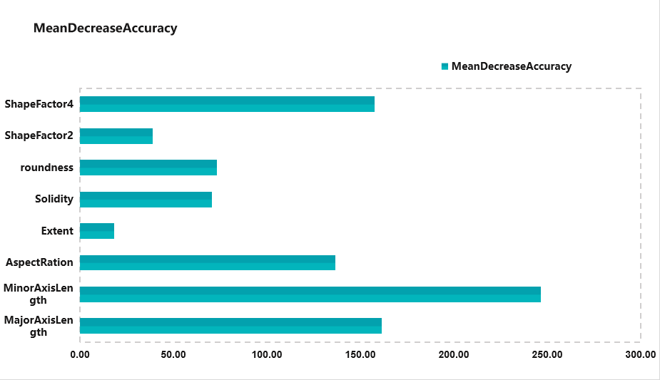

- SVM polynomial kernel performance:

  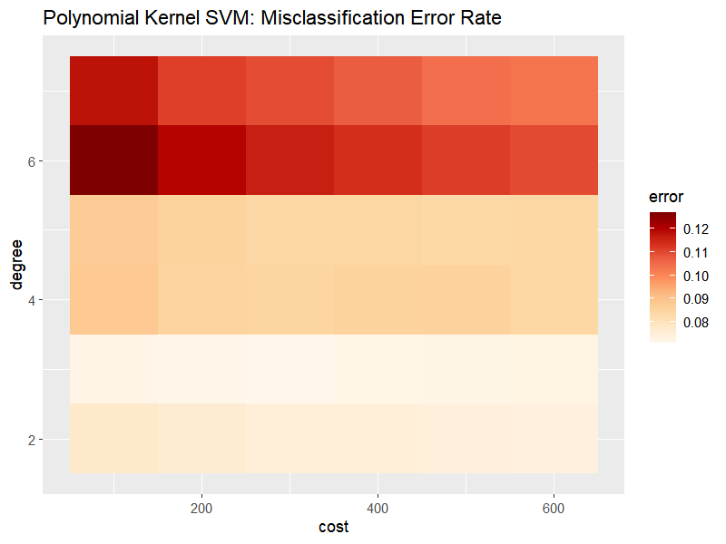

- Possible MLP structure:

  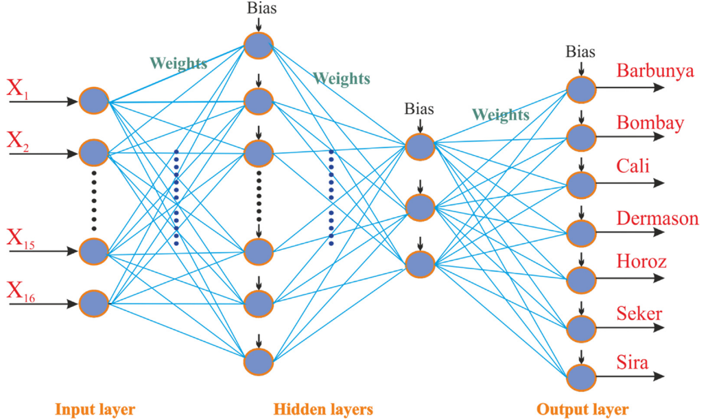

- SVM performance on test set:

  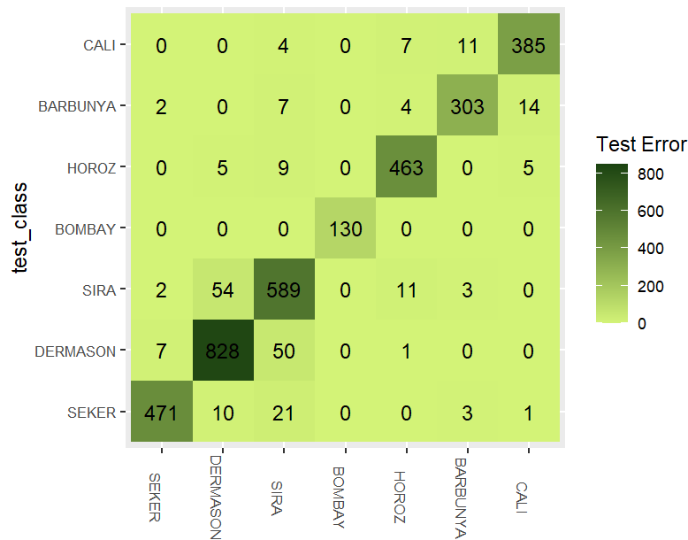
